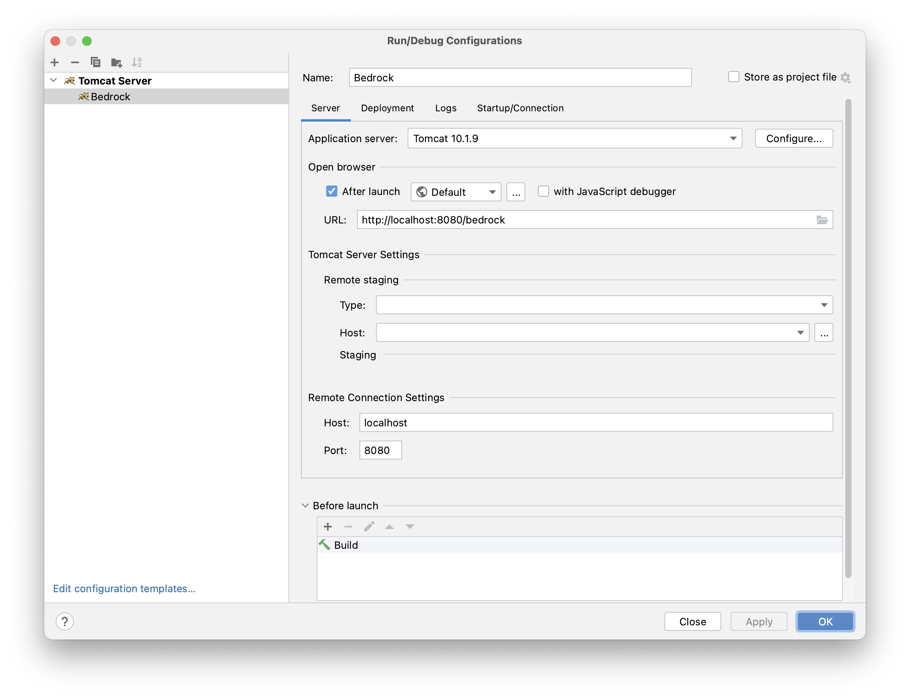
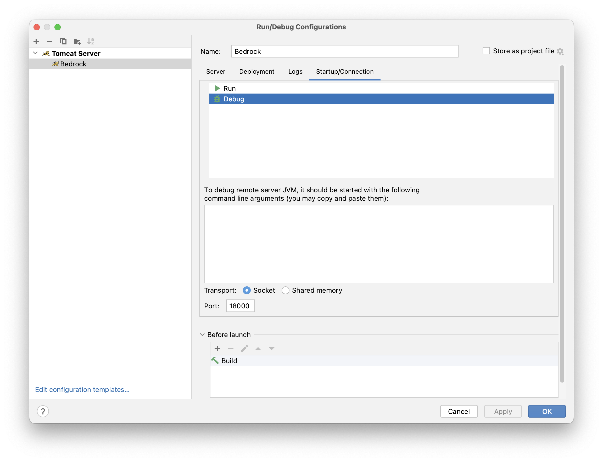

# Bedrock - Java

## Build Requirements
* mongodb
* docker
* gcc
* gnupg2
* node
    * yuidoc
    * uglifyjs

## Homebrew on MacOS
Use brew and then npm to install required components:
```
xcode-select --install
brew install git openjdk maven ant tomcat node gcc gnupg2
brew install --cask docker
brew tap mongodb/brew; brew update; brew install mongodb-community
npm -g install uglify-js
npm -g install yuidocjs
```

### Silicon
Use brew to configure the environment from your shell profile (as opposed to just adding brew to the path). We stubbornly use the bash shell to capitalize on years of bash scripts on many versions of linux, cygwin on PCs, and (previously) bash on MacOS. 

On Apple silicon (M1, M2, etc.):
```
eval "$(/opt/homebrew/bin/brew shellenv)"
```

On Intel silicon:
```
eval "$(/usr/local/bin/brew shellenv)"
```

The install location of homebrew is different between Intel silicon and Apple Silicon (/usr/local vs /opt/homebrew). Using the environment variable $HOMEBREW_PREFIX created by the shellenv action can help to keep scripts portable.

Another way to deal with the difference is to symlink /usr/local to /opt/homebrew on Intel silicon:

```
sudo ln -s /usr/local /opt/homebrew
```

### Versions
Working with the brew installations of some core packages (like the Java Development Kit) can be troublesome when updates happen and your version disappears. The complete installations are maintained in the `$HOMEBREW_PREFIX/Cellar` directory, but best-practice is to use the symlinks in the `$HOMEBREW_PREFIX/opt` directory, so you don't have to hard code a version. 

There will typically be links to the Cellar named with and without a version number. For instance:

```
tomcat      -> ../Cellar/tomcat/10.1.9
tomcat@10   -> ../Cellar/tomcat/10.1.9
```

### Java
For Java, most applications expect the JDK to be in `/Library/Java/JavaVirtualMachines/`, but brew won't automatically do this. Add a link manually like this:

```
pushd /Library/Java/JavaVirtualMachines/
sudo ln -s $HOMEBREW_PREFIX/opt/openjdk/libexec/openjdk.jdk openjdk
```

### Tomcat
The brew version of tomcat remaps the standard error stream in the service. If you want tomcat to put logs in the "normal" place, change the tomcat configuration plist in:
```
$HOMEBREW_PREFIX/opt/tomcat/homebrew.mxcl.tomcat.plist
```

Add the following lines inside the `<dict>` node (order is important, and each pair is two keys in sequence):
```
<key>StandardOutputPath</key>
<string>/opt/homebrew/opt/tomcat/libexec/logs/catalina.out</string>
<key>StandardErrorPath</key>
<string>/opt/homebrew/opt/tomcat/libexec/logs/catalina.out</string>
```
Remember the value of $HOMEBREW_PREFIX is different on Intel silicon from Apple Silicon, so make sure you set the path in the plist to match your installation.

Restart the tomcat service to implement the change:

```
brew services restart tomcat
```

Once this is done, you can track the log using tail:

```
tail -f $HOMEBREW_PREFIX/opt/tomcat/libexec/logs/catalina.out
```

#### Live Debugging In Tomcat With IntelliJ
Configure the tomcat server with the debugging port open by placing a `setenv.sh` file in the tomcat bin directory (`$HOMEBREW_PREFIX/opt/tomcat/libexec/bin`), with the following code:

```
#! /usr/bin/env bash
export CATALINA_OPTS="$CATALINA_OPTS -agentlib:jdwp=transport=dt_socket,server=y,suspend=n,address=18000"
```
 Then configure IntelliJ IDEA with a debug configuration referencing a remote tomcat server. The configuration is probably already correct once you create it, but you will need to update the following values:

 - In the Server tab, set the Server to your installation ($HOMEBREW_PREFIX/opt/tomcat/libexec), and if you want to launch a browser automatically, set the url to "http://localhost:8080/bedrock".

 - In the Startup/Connection tab, set the Transport to "Socket" and the Port to 18000 (as configured in the tomcat env above).




### Docker
After installation with brew, launch the docker desktop application and update the settings to start automatically on login.

## Maven
Building Bedrock with maven activates the irdev profile if it's configured in your ~/.m2/settings.xml. Maven settings are needed specifically for deployment, but may use other properties in the future. The settings.xml should be as follows:
```
<settings>
    <servers>
        <server>
            <id>ossrh</id>
            <username>irdev</username>
            <password>* the nexus password *</password>
        </server>
    </servers>

    <profiles>
        <profile>
            <id>irdev</id>
            <activation>
                <property>
                    <name>activate.profile</name>
                    <value>irdev</value>
                </property>
            </activation>
            <properties>
                <profile-name>irdev (Inbound Research LLC)</profile-name>
                <gpg.passphrase>* the gpg passphrase *</gpg.passphrase>
                <gpg.keyname>info@irdev.us</gpg.keyname>
            </properties>
        </profile>
    </profiles>
</settings>
```

[Maven Central](https://search.maven.org/artifact/us.irdev.bedrock/bedrock)

## Bedrock-1.x
The Bedrock-1.x docker environment is intended to support testing of web-based interactions when building Bedrock-2.x with maven, and should be started via docker-compose prior to building.
